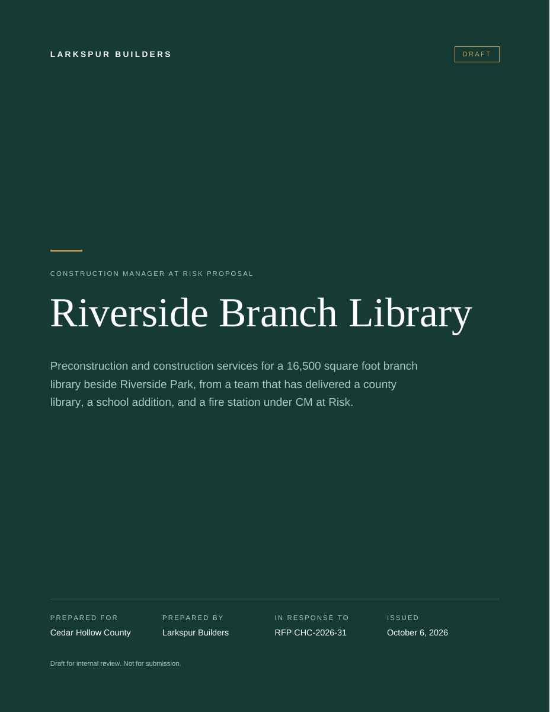

# Riverside Branch Library proposal

A ten-page CM at Risk proposal draft, rendered with pdfcn and Forme from
[proposal.json](proposal.json). It is organized in the RFP's Tab A to G order
with the fee, the required forms, and a compliance matrix appendix. Six pages
count toward the 20-page limit.

The [compliance check](output-compliance-check.md) says it is **not ready to
submit**: Tab G (small and local business participation) has nothing to answer
it, and Form 2 is missing. It also flags a claim lifted from a 2024 proposal
that hasn't been confirmed, and shows where the EMR and a project value
differed between the library and older proposals.

[Rendered PDF](output-proposal.pdf) · [Page preview](output-proposal.html) ·

Everything here is fictional: the county, the firm, its people, and its
projects. The preview contains rasterized pages from the actual PDF.
